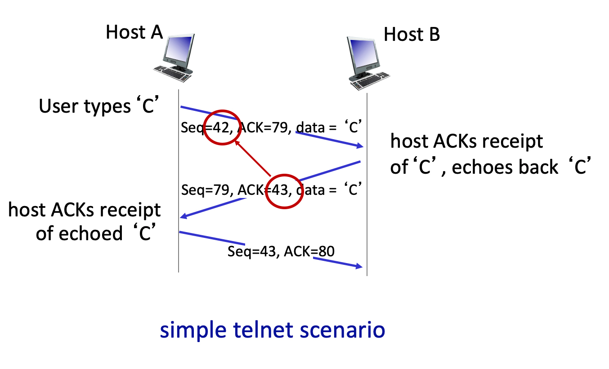
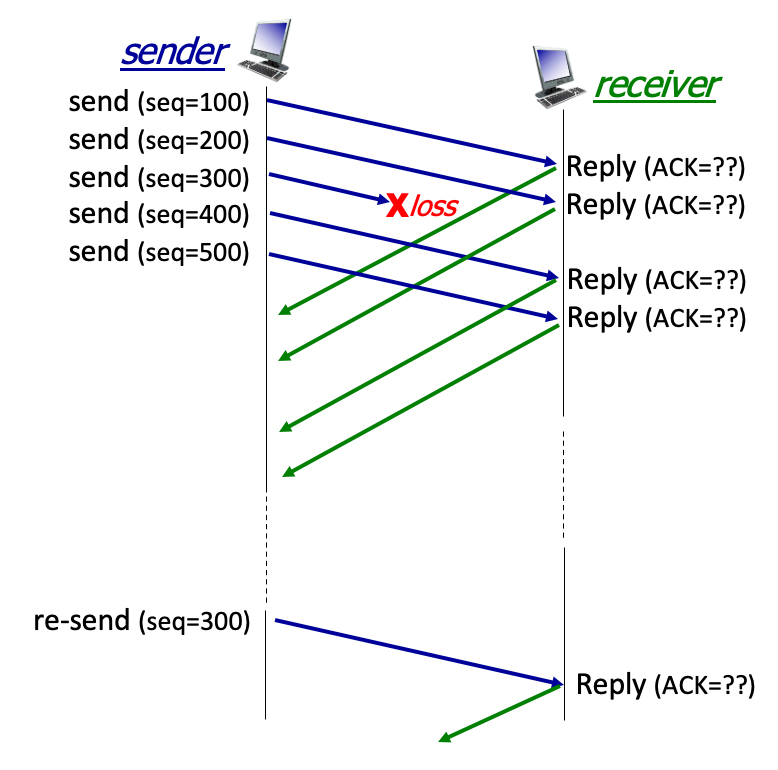
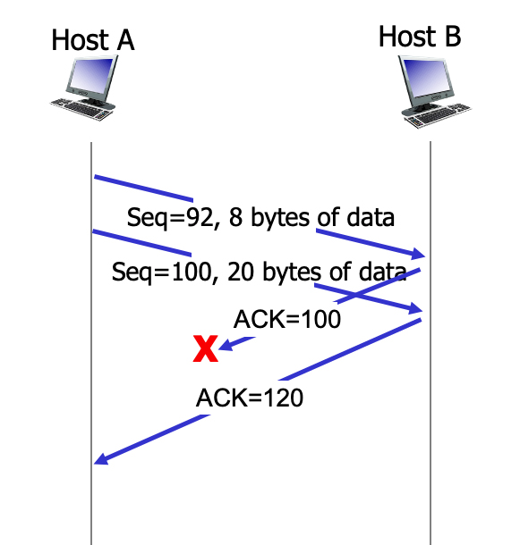
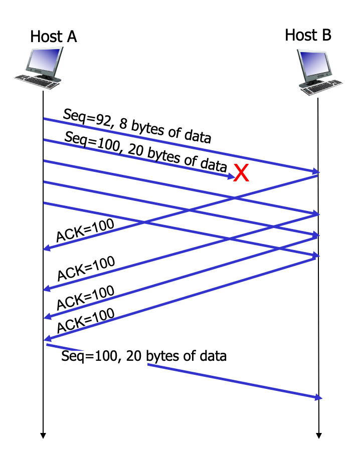

# 3.5 Connection-Oriented Transport: TCP
## TCP Reliability Semantics

 Q: True or False:  On the sending side, the TCP sender will take each application-layer chunk of data written into a TCP socket and send it in a distinct TCP segment. And then on the receiving side, TCP will deliver a segment’s payload into the appropriate socket, preserving the application-defined message boundary.

A: False.

## TCP Segment Format
Data (or payload) = This field contains application data that was written into a socket by the sender of this TCP segment.

Sequence number = This field contains the index in the sender-to-receiver byte stream of the first byte of that data in the payload carried in this segment.

Checksum = This field contains the Internet checksum of the TCP segment and selected fields in the IP datagram header.

Receiver advertised window = This field contains the number of available bytes in the TCP receiver’s buffer.

Source port number = This field contains the port number associated with the sending socket for this TCP segment.

Header length field = This field contains the number of bytes in the TCP header.

ACK bit = If set, this segment cumulatively ACKs all data bytes up to, but not including, the byte index in the ACK value field of this segment.

ACK number field = This field contains the index in the byte stream of the next in-order byte expected at the receiver.

## TCP sequence numbers and ACKs (1).
Q: Consider the TCP Telnet scenario below (from Fig. 3.31 in text). Why is it that the receiver sends an ACK that is one larger than the sequence number in the received datagram?

A: Because the send-to receiver segment carries only one byte of data, and after that segment is received, the next expected byte of data is just the next byte (i.e., has an index that is one larger) in the data stream.

## TCP sequence numbers and ACKs (2).
Suppose that as shown in the figure below, a TCP sender is sending segments with 100 bytes of payload.  The TCP sender sends five segments with sequence numbers 100, 200, 300, 400, and 500.  Suppose that the segment with sequence number 300 is lost.  The TCP receiver will buffer correctly-received but not-yet-in-order segments for later delivery to the application layer (once missing segments are later received). 

After receiving segment 100, the receiver responds with an ACK with value: 200

After receiving segment 200, the receiver responds with an ACK with value: 300

After receiving segment 500, the receiver responds with an ACK with value: 300, a duplicate ACK

After receiving the retransmitted segment 300, the receiver responds with an ACK with value: 600

The TCP receiver does not respond in the example, with an ACK with value: 400

## TCP RTT Estimation: EWMA.
Q: Consider TCP use of an exponentially weighted moving average (EWMA) to compute the nth value of the estimated RTT:

> EstimatedRTTn = (1- a)\*EstimatedRTTn-1 + a\*SampleRTTn

True or False: with this EWMA algorithm the value of EstimatedRTTn  has no dependence on the earlier sample, SampleRTTn-1  
A: False.

## TCP timer management.
Consider the TCP Telnet scenario below (from Fig. 3.36 in text). What timer-related action does the sender take on the receipt of ACK 120?

( ) Restarts a timer for the segment with sequence number 92.

( ) Leaves any currently-running timers running.

(x) Cancels any running timers.

## TCP Flow Control.
Q: True or False:  with TCP’s flow control mechanism, where the receiver tells the sender how much free buffer space it has (and the sender always limits the amount of outstanding, unACKed, in-flight data to less than this amount), it is not possible for the sender to send more data than the receiver has room to buffer.

A: True.

## TCP connection management.
Match the description of a TCP connection management message with the name of the message used to accomplish that function.

SYN = A message from client to server initiating a connection request.

SYNACK = A message from server to client ACKing receipt of a SYN message and indicating the willingness of the server to establish a TCP connection with the client.

FIN = A message indicating that the sending side is initiating the protocol to terminate a connection.

FINACK = A message sent in response to a request to terminate a connection, ACKing that the side receiving this message is also willing to terminate the connection

RESET = A general purpose error message used during connection set up or tear down to let the other side know that an error has occurred, and that the referenced connection should be shut down.

## TCP Fast Retransmit.
Consider TCP’s Fast Retransmit optimization (see Figure 3.37 from the text, below).  Of course, the sender doesn't know for sure that the segment with sequence # 100 is actually lost (it can’t see into the channel). Can a sender get three duplicate ACKs for a segment that in fact has not been lost? Which of the following statements are true?  Suppose a channel can lose, but will not corrupt, messages.

(x) If the channel cannot reorder messages, a triple duplicate ACK indicates to the sender that a segment loss has happened for sure. Actually (again assuming the channel cannot corrupt or reorder messages), even a single duplicate ACK would indicate that a segment loss has happed for sure.

(x) If the channel can reorder messages, a triple duplicate ACK can occur even though a message is not lost; since it's possible that a message has just been reordered and has not yet arrived when the three duplicate ACKs were generated.
