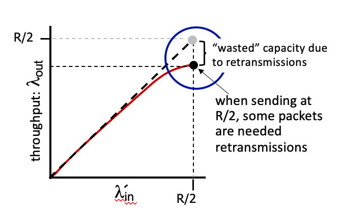

# 3.6 Principles of Congestion Control

## Difference between congestion control and flow control
Flow control = single sender sends too much data.

Congestion control = multiple senders send too much data.

## Two congested senders.
Consider the figure below, which shows the application-to-application throughput achieved when two senders are competing at a shared bottleneck link.  Suppose that when the overall arrival rate,  lambdain' (for each sender) is close to R/2, the throughput to the application layer (at each receiver), lambdaout, is equal to 0.8 *  lambdain'.

What fraction of the packets transmitted at the sender are retransmissions?

Answer: 0.2.

## Network-assisted or end-end congestion control?
Which of the following actions are used in network-assisted congestion control (say versus end-end congestion control) to signal congestion. Check all that apply.

* A router marks a field in the datagram header at a congested router.
* A router sends an ICMP message to a host telling it to slow down its sending rate.

## Network-assisted or end-end congestion control (2)?

Which of the following actions are associated with end-end congestion control (say versus network-assisted congestion control). Check all that apply.

* A router drops a packet at a congested router, which causes the transport-layer sender to infer that there is congestion due to the missing ACK for the lost packet.
* A datagram experiences delay at a congested network router, which is then measured by the sender and used to decrease the sending rate.
* A sender decreases its sending rate in response to packet loss detected via its transport-layer ACKing.
* The transport-layer sender decreases its sending rate in response to a measured increase in the RTT.

## Different approaches towards congestion control.

* Network-assisted: Bits are set at a congested router in a sender-to-receiver datagram, and bits are in the returned to the sender in a receiver-to sender ACK, to indicate congestion to the sender.

* Delay-based: The sender measures RTTs and uses the current RTT measurement to infer the level of congestion.

* End-end: The sender infers segment loss from the absence of an ACK from the receiver.