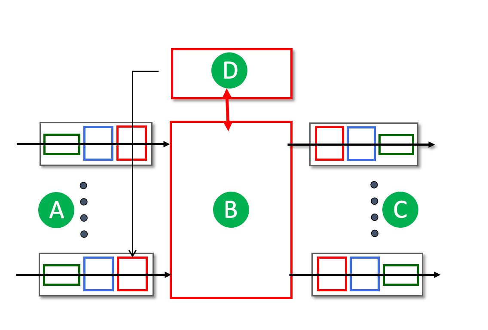
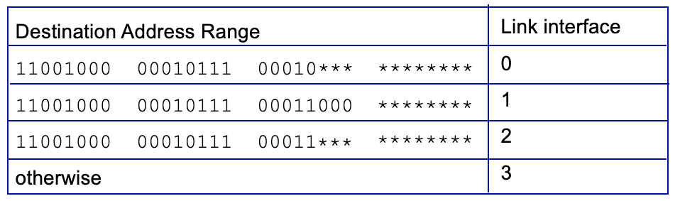
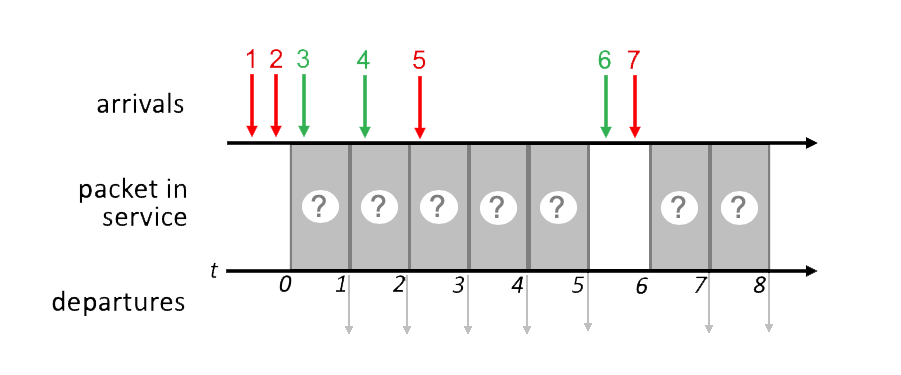
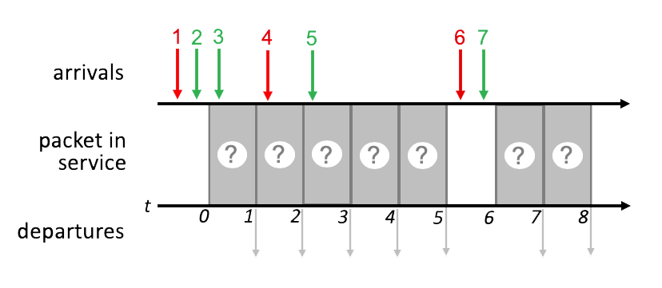

# 4.2 What's inside of a router?

## What's inside a router?
Match the names of the principal router components (A,B,C,D below) with their function and whether they are in the network-layer data plane or control plane.

- A = input ports, operating primarily in the data plane.
- B = the switching fabric, operating primarily in the data plane.
- C = output ports, operating primarily in the data plane.
- D = the routing processor, operating primarily in the control plane.

## Where does destination address lookup happen?
Where in a router is the destination IP address looked up in a forwarding table to determine the appropriate output port to which the datagram should be directed?

- [ ] Within the routing processor.
- [ ] At the output port leading to the next hop towards the destination.
- [x] At the input port where a packet arrives.
- [ ] Within the switching fabric.

## Where does "match+action" happen?
Where in a router does "match plus action" happen to determine the appropriate output port to which the arriving datagram should be directed?

- [ ] At the output port leading to the next hop towards the destination.
- [x] At the input port where a packet arrives.
- [ ] Within the switching fabric.
- [ ] Within the routing processor.

##Longest prefix matching.
Consider the following forwarding table below. Indicate the output to link interface to which a datagram with the destination addresses below will be forwarded under longest prefix matching. (Note: The list of addresses is ordered below. If two addresses map to the same output link interface, map the first of these two addresses to the first  instance of that link interface.) [Note: You can find more examples of problems similar to this [here.](http://gaia.cs.umass.edu/kurose_ross/interactive/?q=c4q2)]

## Packet dropping.
Suppose a datagram is switched through the switching fabric and arrives to its appropriate output to find that there are no free buffers.  In this case:

- [ ] Another packet will be removed (lost) from the buffer to make room for this packet.
- [x] The packet will either be dropped or another packet will be removed (lost) from the buffer to make room for this packet, depending on policy.  But the packet will definitely not be be sent back to the input port.
- [ ] The packet will be dropped (lost).
- [ ] The packet will be sent back to the input port.

## HOL blocking.
What is meant by Head of the Line (HOL) blocking?

- [ ] In a block error code, the first bytes of the code indicate the type of coding being used.
- [ ] A queued datagram receiving service at the front of a queue prevents other datagrams in queue from receiving service.
- [x] A queued datagram waiting for service at the front of a queue prevents other datagrams in queue from moving forward in the queue.

## Packet scheduling (Scenario 1, FCFS).
Consider the pattern of red and green packet arrivals to a router’s output port queue, shown below. Suppose each packet takes one time slot to be transmitted, and can only begin transmission at the beginning of a time slot after its arrival.  Indicate the sequence of departing packet numbers (at t = 1, 2, 3, 4, 5, 7, 8) under FCFS scheduling. Give your answer as 7 ordered digits (each corresponding to the packet number of a departing packet), with a single space between each digit, and no spaces before the first or after the last digit, e.g., in a form like 7 6 5 4 3 2 1).

[Note: You can find more examples of problems similar to this [here](http://gaia.cs.umass.edu/kurose_ross/interactive/?q=c4q5).]

Answer: 1 2 3 4 5 6 7

## Packet scheduling (Scenario 1, Priority).
Consider the pattern of red and green packet arrivals to a router’s output port queue, shown below. Suppose each packet takes one time slot to be transmitted, and can only begin transmission at the beginning of a time slot after its arrival.  Indicate the sequence of departing packet numbers (at t = 1, 2, 3, 4, 5, 7, 8) under priority scheduling, where red packets have higher priority.

Give your answer as 7 ordered digits (each corresponding to the packet number of a departing packet), with a single space between each digit, and no spaces before the first or after the last digit, e.g., in a form like 7 6 5 4 3 2 1).

[Note: You can find more examples of problems similar to this [here](http://gaia.cs.umass.edu/kurose_ross/interactive/?q=c4q5).]

Answer: 1 2 3 5 4 7 6

## Packet scheduling (Scenario 1, RR).
Consider the pattern of red and green packet arrivals to a router’s output port queue, shown below. Suppose each packet takes one time slot to be transmitted, and can only begin transmission at the beginning of a time slot after its arrival.  Indicate the sequence of departing packet numbers (at t = 1, 2, 3, 4, 5, 7, 8) under round robin scheduling, where red starts a round if there are both red and green packets ready to transmit after an empty slot.

Give your answer as 7 ordered digits (each corresponding to the packet number of a departing packet), with a single space between each digit, and no spaces before the first or after the last digit, e.g., in a form like 7 6 5 4 3 2 1).

Answer: 1 3 2 4 5 7 6

## Packet scheduling (Scenario 2, FCFS).
Consider the pattern of red and green packet arrivals to a router’s output port queue, shown below. Suppose each packet takes one time slot to be transmitted, and can only begin transmission at the beginning of a time slot after its arrival.  Indicate the sequence of departing packet numbers (at t = 1, 2, 3, 4, 5, 7, 8) under FCFS scheduling. Give your answer as 7 ordered digits (each corresponding to the packet number of a departing packet), with a single space between each digit, and no spaces before the first or after the last digit, e.g., in a form like 7 6 5 4 3 2 1).

Answer: 1 2 3 4 5 6 7

## Packet scheduling (Scenario 2, Priority).
Consider the pattern of red and green packet arrivals to a router’s output port queue, shown below. Suppose each packet takes one time slot to be transmitted, and can only begin transmission at the beginning of a time slot after its arrival.  Indicate the sequence of departing packet numbers (at t = 1, 2, 3, 4, 5, 7, 8) under priority scheduling, where red packets have higher priority.

Give your answer as 7 ordered digits (each corresponding to the packet number of a departing packet), with a single space between each digit, and no spaces before the first or after the last digit, e.g., in a form like 7 6 5 4 3 2 1).

Answer: 1 2 4 3 5 6 7

## Packet scheduling (Scenario 2, RR).
Consider the pattern of red and green packet arrivals to a router’s output port queue, shown below. Suppose each packet takes one time slot to be transmitted, and can only begin transmission at the beginning of a time slot after its arrival.  Indicate the sequence of departing packet numbers (at t = 1, 2, 3, 4, 5, 7, 8) under round robin scheduling, where red starts a round if there are both red and green packets ready to transmit after an empty slot.

Give your answer as 7 ordered digits (each corresponding to the packet number of a departing packet), with a single space between each digit, and no spaces before the first or after the last digit, e.g., in a form like 7 6 5 4 3 2 1).

Answer: 1 2 4 3 5 6 7