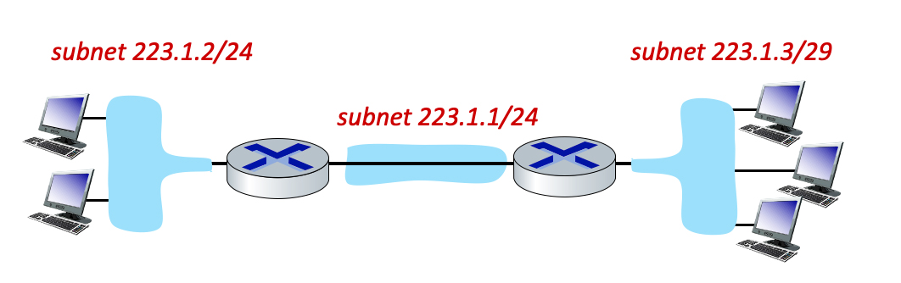

# 4.3 Internet Protocol

## What is the Internet Protocol?

What are the principal components of the IPv4 protocol (check all that apply)?

- [x] Packet handling conventions at routers (e.g., segmentation/reassembly)
- [ ] ICMP (Internet Control Message Protocol)
- [ ] Routing algorithms and protocols like OSPF and BGP.
- [ ] SDN controller protocols.
- [x] IPv4 datagram format.
- [x] IPv4 addressing conventions.

The IPv4 header.

Match each of the following fields in the IP header with its description, function or use.

* Version field = This field contains the IP protocol version number.
* Type-of-service field = This field contains ECN and differentiated service bits.
* Fragmentation offset field = This field is used for datagram fragmentation/reassembly.
* Time-to-live field = The value in this field is decremented at each router; when it reaches zero, the packet must be dropped. 
* Header checksum field = This field contains the Internet checksum of this datagram's header fields.
* Upper layer field = This field contains the "protocol number" for the transport-layer protocol to which this datagram's payload will be demultiplexed - UDP or TCP, for example.
* Payload/data field = This field contains a UDP or TCP segment, for example.
* Datagram length field = This field indicates the total number of bytes in datagram.

## What is an IP address actually associated with?

Which of the following statements is true regarding an IP address? (Zero, one or more of the following statements is true).
- [ ] It is not necessary for a device using the IP protocol to actually have an IP address associated with it.
- [x] If a host has more than one interface, then it has more that one IP address at which it can be reached.
- [x] If a router has more than one interface, then it has more that one IP address at which it can be reached.
- [x]  An IP address is associated with an interface.

## What is a subnet?

What is meant by an IP subnet? (Check zero, one or more of the following characteristics of an IP subnet).
- [ ] A set of devices all manufactured by the same equipment maker/vendor.
- [ ] A set of devices that always have a common first 16 bits in their IP address.
- [x] A set of device interfaces that can physically reach each other without passing through an intervening router.
- [x] A set of devices that have a common set of leading high order bits in their IP address.

## Subnetting(a).
Consider the three subnets in the diagram below.

What is the maximum # of interfaces in the 223.1.2/24 network?

- [ ] 2**32
- [ ] 128
- [ ] There's no a priori limit on the number of interfaces in this subnet.
- [ ] Two hosts, as shown in the figure.
- [ ] 256

What is the maximum # of interfaces in the 223.1.3/29 network?

- [ ] There's no a priori limit on the number of interfaces in this subnet.
- [ ] Three hosts, as shown in the figure.
- [ ] 2**32
- [x] 8
- [ ] 128

Which of the following addresses can _not_ be used by an interface in the 223.1.3/29 network? Check all that apply.

- [x] 223.1.2.6
- [ ] 223.1.3.2
- [ ] 223.1.3.6
- [x] 223.1.3.28
- [x] 223.1.3.16

## Plug-and-play.
What is meant by saying that DHCP is a "plug and play" protocol?

- [x] No manual configuration is needed for the host to join the network.
- [ ] The network provides an Ethernet jack for a host’s Ethernet adapter.
- [ ] The host needs to “plug” (by wire or wirelessly) into the local network in order to access (“play” in) the Internet

## DHCP request message. 
Which of the following statements about a DHCP request message are true (check all that are true). Hint: check out Figure 4.24 in the 7th and 8th edition of our textbook.

- [x] A DHCP request message may contain the IP address that the client will use.
- [ ] A DHCP request message is optional in the DHCP protocol.
- [x] A DHCP request message is sent broadcast, using the 255.255.255.255 IP destination address.
- [x] The transaction ID in a DHCP request message will be used to associate this message with future DHCP messages sent from, or to, this client.
- [ ] A DHCP request message is sent from a DHCP server to a DHCP client.
- [ ] The transaction ID in a DCHP request message is used to associate this message with previous messages sent by this client.

## IPv4 versus IPv6. 
Which of the following fields occur _ONLY_ in the IPv6 datagram header (i.e., appear in the IPv6 header but not in the IPv4 header)?  Check all that apply.

- [ ] The upper layer protocol (or next header) field.
- [x] The flow label field.
- [ ] The options field.
- [ ] The header checksum field.
- [ ] The time-to-live (or hop limit) field.
- [ ] The IP version number field.
- [ ] The header length field.
- [x] 128-bit source and destination IP addresses.

## Purpose of DHCP. 
What is the purpose of the Dynamic Host Configuration Protocol?

- [ ] To configure the set of available open ports (and hence well-known services) for a server.
- [x] To obtain an IP address for a host attaching to an IP network.
- [ ] To get the 48-bit link-layer MAC address associated with a network-layer IP address.
- [ ] To configure the interface speed to be used, for hardware like Ethernet, which can be used at different speeds.
