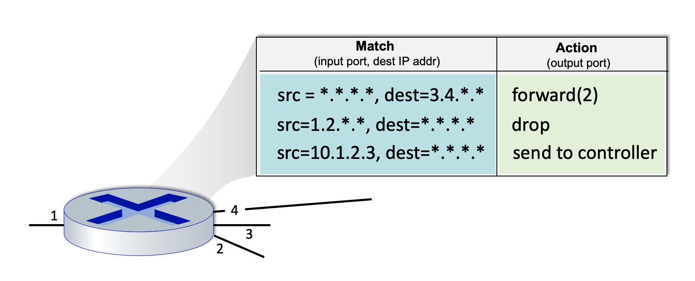
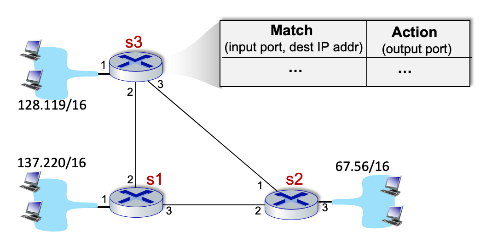

# 4.4 Generalized Forwarding

## Destination-based match+action.  
Destination-based forwarding, which we studied in section 4.2, is a specific instance of match+action and generalized forwarding.  Select the phrase below which best completes the following sentence:

"In destination-based forwarding, ..."

- [ ] ... after matching on the port number in the segment's header, the action taken is to decide whether or not to drop the datagram containing that segment.
- [ ] ... after matching on the source and destination IP address in the datagram header, the action taken is to forward the datagram to the output port associated with that source and destination IP address pair.
- [ ] ... after matching on the URL contained in an HTTP GET request in the TCP segment within the IP datagram, the action taken is to determine the IP address of the server associated with that URL, and to forward the datagram to the output port associated with that destination IP address.
- [ ] ... after matching on the destination IP address in the datagram header, the action taken is to decide whether or not to drop that datagram.
- [ ] ... after matching on the port number in the segment's header, the action taken is to forward the datagram to the output port associated with that port number.
- [ ] ... after matching on the 48-bit link-layer destination MAC address, the action taken is to forward the datagram to the output port associated with that link-layer address.
- [x] ... after matching on the destination IP address in the datagram header, the action taken is to forward the datagram to the output port associated with that destination IP address.

## Generalized match+action.
Which of the following match+actions can be taken in the generalized OpenFlow 1.0 match+action paradigm that we studied in Section 4.4?  Check all that apply.

- [x] ... after matching on the port number in the segment's header, the action taken is to decide whether or not to drop that datagram containing that segment.
- [x] ... after matching on the destination IP address in the datagram header, the action taken is to decide whether or not to drop that datagram.
- [x] ... after matching on the port number in the segment's header, the action taken is to forward the datagram to the output port associated with that destination IP address.
- [x] ... after matching on the source and destination IP address in the datagram header, the action taken is to forward the datagram to the output port associated with that source and destination IP address pair.
- [ ] ... after matching on the URL contained in an HTTP GET request in the TCP segment within the IP datagram, the action taken is to determine the IP address of the server associated with that URL, and to forward the datagram to the output port associated with that destination IP address.
- [x] ... after matching on the destination IP address in the datagram header, the action taken is to forward the datagram to the output port associated with that destination IP address.
- [x] ... after matching on the 48-bit link-layer destination MAC address, the action taken is to forward the datagram to the output port associated with that link-layer address.

## What fields can be matched in generalized match+action.
Which of the following fields in the frame/datagram/segment/application-layer message can be matched in OpenFlow 1.0? Check all that apply.

- [ ] URL in HTTP message
- [x] Upper layer protocol field
- [x] IP source address
- [ ] Number of bytes in the datagram
- [x] IP type-of-service field
- [x] Source and/or destination port number
- [x] IP destination address
- [ ] Time-to-live field

## Match+action in Openflow 1.0.
Consider the figure below that shows the generalized forwarding table in a router.  Recall that a * represents a wildcard value. Now consider an arriving datagram with the IP source and destination address fields indicated below.  For each source/destination IP address pair, indicate which rule is matched. Note: assume that a rule that is earlier in the table takes priority over a rule that is later in the table and that a datagram that matches none of the table entries is dropped.

* Source: 1.2.56.32 Destination:128.116.40.186  = Rule 2, with action drop
* Source: 65.92.15.27 Destination: 3.4.65.76    = Rule 1, with action forward(2)
* Source: 10.1.2.3 Destination: 7.8.9.2         = Rule 3, with action send to controller
* Source: 10.1.34.56 Destination: 54.72.29.90   = No match to any rule.

## Crafting network-wide forwarding using flow tables.
Consider the network below.  We want to specify the match+action rules at s3 so that only the following network-wide behavior is allowed:

* traffic from 128.119/16 and destined to 137.220/16 is forwarded on the direct link from s3 to s1;
* traffic from 128.119/16 and destined to 67.56/16 is forwarded on the direct link from s3 to s2;
* incoming traffic via port 2 or 3, and destined to 128.119/16 is forwarded to 128.119/16 via local port 1. 
* No other forwarding should be allowed.  In particular s3 should not forward traffic arriving from 137.220/16 and destined for 67.56/16 and vice versa.

From the list of match+action rules below, select the rules to include in s3's flow table to implement this forwarding behavior. Assume that if a packet arrives and finds no matching rule, it is dropped.

- [ ] Input port: 3; Dest: 137.220/16         Action: forward(2)
- [ ] Input port:1 ; Dest: 137.220/16         Action: forward(3)
- [ ] Input port: 1; Dest: 67.56/16           Action: forward(2)
- [x] Input port: 2; Dest: 128.119/16         Action: forward(1)
- [x] Input port:1 ; Dest: 137.220/16         Action: forward(2)
- [x] Input port: 1; Dest: 67.56/16           Action: forward(3)
- [ ] Input port: 2; Dest: 67.56/16           Action: forward(3)
- [x] Input port: 3; Dest: 128.119/16         Action: forward(1)

## Crafting network-wide forwarding using flow tables (more).
Consider the network below.  We want to specify the match+action rules at s3 so that s3 acts only as a relay for traffic between 137.220/16 and 67.56/16.  In particular s3 should not accept/forward and traffic to/from 128.119/16.

From the list of match+action rules below, select the rules to include in s3's flow table to implement this forwarding behavior. Assume that if a packet arrives and finds no matching rule, it is dropped.

- [ ] Input port: 1; Dest: 67.56/16         Action: forward(2)
- [ ] Input port: 3; Dest: 128.119/16       Action: forward(1)
- [ ] Input port:1 ; Dest: 137.220/16       Action: forward(2)
- [x] Input port: 2; Dest: 67.56/16         Action: forward(3)
- [ ] Input port:1 ; Dest: 137.220/16       Action: forward(3)
- [ ] Input port: 1; Dest: 67.56/16         Action: forward(3)
- [x] Input port: 3; Dest: 137.220/16       Action: forward(2)
- [ ] Input port: 2; Dest: 128.119/16       Action: forward(1)

## Generalized forwarding.  
What is meant by generalized forwarding (as opposed to destination-based forwarding) in a router or switch?

- [ ] None of the other answers is a correct definition of generalized forwarding.
- [ ] In addition to performing forwarding, the device can generalize its services, also performing hop-by-hop reliable data transfer and per-hop congestion control.
- [ ] The decision about which output port to forward a packet to can be made based on the link-type of the outgoing port (e.g., Ethernet versus WiFi).
- [x] Any of several actions (including drop (block), forward to a given interface, or duplicate-and-forward) can be made based on the contents of one or more packet header fields.
