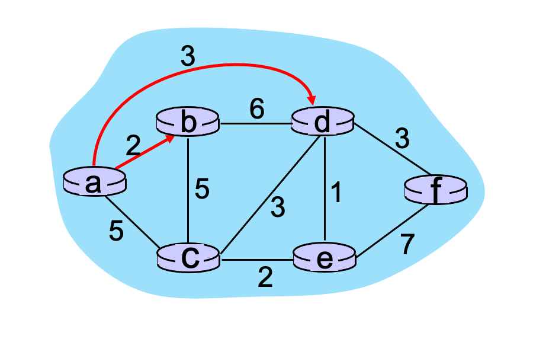

# 5.2 Routing algorithms

## What’s a “good” path?
What is the definition of a “good” path for a routing protocol? Chose the best single answer.

- [ ] A low delay path.
- [ ] A path that has a minimum number of hops.
- [ ] A path that has little or no congestion.
- [ ] A high bandwidth path.
- [x] Routing algorithms typically work with abstract link weights that could represent any of, or combinations of, all of the other answers.

## Dijkstra’s link-state routing algorithm.
Consider Dijkstra’s link-state routing algorithm that is computing a least-cost path from node a to other nodes b, c, d, e,  f.  Which of the following statements is true.  (Refer to Section 5.2 in the text for notation.)

- [x] In the initialization step, the initial cost from a to each of these destinations is initialized to either the cost of a link directly connecting a to a direct neighbor, or infinity otherwise.
- [ ] The values computed in the vector D(v), the currently known least cost of a path from a to any node v, will always decrease following an iteration.
- [x] Suppose nodes b, c, and d are in the set N’.  These nodes will remain in N’ for the rest of the algorithm, since the least-cost paths from a to b, c, and d are known.
- [ ] Following the initialization step, if nodes b and c are directly connected to a, then the least cost path to b and c will never change from this initial cost.
- [x] The values computed in the vector D(v), the currently known least cost of a path from a to any node v, will never increase following an iteration.

## What type of routing?
Match the name of a general approach to routing with characteristics of that approach.

* Centralized, global routing = All routers have complete topology, and link cost information.
* Decentralized routing = An iterative process of computation, exchange of informatoin with neighbors. Routers may initially only know link costs to directly-attached neighbors.
* Static routing = Routes change slowly over time.
* Dynamic routing = Routing changes quickly over time.

## Dijkstra’s link-state routing algorithm (Part 1).
Consider the graph shown below and the use of Dijkstra’s algorithm to compute a least cost path from a to all destinations.  Suppose that nodes b and d have already been added to N’. What is the next node to be added to N' (refer to the text for an explanation of notation).

- [ ] c
- [ ] f
- [x] e

## Dijkstra’s link-state routing algorithm (Part 2).
Consider the graph shown below and the use of Dijkstra’s algorithm to compute a least cost path from a to all destinations.  Suppose that nodes b and d have already been added to N’. What is the path cost to the next node to be added to N' (refer to the text for an explanation of notation).

- [x] 4
- [ ] 6
- [ ] 7
- [ ] 5
